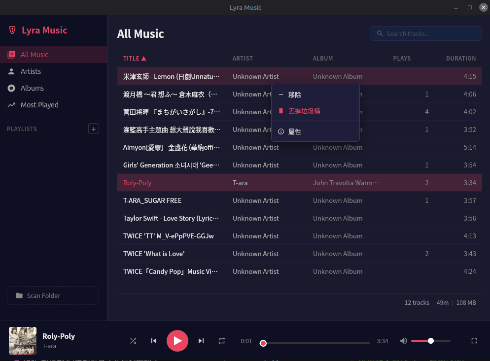

# Lyra Music

基於 Tauri 2 + Svelte 5 + Rust 的桌面音樂播放器。純本地離線播放，不依賴任何網路服務。

## 畫面截圖




## 下載

前往 **[GitHub Releases](https://github.com/twtrubiks/lyra-music/releases/latest)** 下載最新版本（支援 AppImage、deb、rpm）。

## 技術架構

延伸閱讀：[為什麼選擇 Rust](docs/why-rust.md)、[Tauri 2 介紹](docs/tauri2-introduction.md)

| 層級 | 技術 | 說明 |
|------|------|------|
| 前端 | Svelte 5 + TypeScript | 使用 Svelte 5 runes 做響應式狀態管理 |
| 建置工具 | Vite 7 | 開發伺服器與前端打包 |
| 桌面框架 | Tauri 2 | 原生視窗、系統匣、IPC 通訊 |
| 後端 | Rust | 音訊處理、檔案掃描、資料庫操作 |
| 音訊引擎 | rodio 0.21 | 純 Rust 實作，不需要安裝 GStreamer、MPV 等系統音訊框架 |
| 元資料解析 | lofty 0.23 | 讀寫 ID3/Vorbis/MP4 標籤與封面圖 |
| 檔案監視 | notify 8 | 即時偵測資料夾變化，自動更新音樂庫 |
| 資料庫 | SQLite (rusqlite, bundled) | WAL mode，schema migration 管理 |
| 測試 | Vitest + cargo test | 前端 10 個測試檔、後端 10 個整合測試 |

## 主要功能

**本地音樂播放** -- 支援 MP3、FLAC、WAV、OGG、M4A、AAC 格式。音訊引擎基於 rodio，play / pause / stop / seek 完整控制，音量使用二次曲線映射（UI 0.5 對應實際 0.25），聽感更自然。

**Gapless playback** -- 預先解碼下一首並 append 到同一 sink，實現無縫銜接。不要求前後曲目 sample rate 一致。

**播放清單與斷點續播** -- 建立、編輯、刪除播放清單，支援拖曳排序。每個播放清單記錄最後播放的曲目 ID 與秒數位置，切換播放清單時自動恢復上次播放進度。

**Mini Player + System Tray** -- 按 `m` 切換為 420x80 精簡視窗（always-on-top）。系統匣支援 Play/Pause、上一首、下一首、顯示視窗、退出。關閉視窗時自動最小化到系統匣。

**Tauri 2 + Svelte 5 + Rust 架構** -- 前後端透過 35 個 Tauri commands 進行 IPC 通訊。前端以 Svelte 5 runes 管理狀態，後端以 Rust 處理音訊解碼、檔案 I/O、資料庫操作。

其他功能：
- 藝人 / 專輯瀏覽視圖（網格封面、搜尋過濾、詳情視圖）
- 曲目元資料編輯（標題、藝人、專輯寫回檔案）
- 資料夾即時監視（新增/修改/刪除自動同步音樂庫）
- 欄標題排序（偏好持久化）、播放計數追蹤（Most Played 排行視圖）
- 音樂庫遞迴掃描，自動讀取 metadata 與封面快取
- 播放模式（循環/單曲/隨機）、即時搜尋過濾、多選操作、右鍵選單、拖放匯入

## 前置需求

- [Node.js](https://nodejs.org/) (LTS)
- [Rust toolchain](https://rustup.rs/) (rustup)
- Tauri 2 系統依賴：參考 [Tauri Prerequisites](https://v2.tauri.app/start/prerequisites/)（macOS/Windows 通常不需要額外安裝）

Linux（Debian/Ubuntu）額外需要：

```
sudo apt install libwebkit2gtk-4.1-dev build-essential curl wget file \
  libssl-dev libayatana-appindicator3-dev librsvg2-dev libasound2-dev
```

## 安裝與啟動

```bash
npm install           # 安裝前端依賴
npm run tauri dev     # 開發模式（同時啟動 Vite dev server 和 Tauri 視窗）
npm run tauri build   # 正式建置
```

建置產物位於 `src-tauri/target/release/bundle/`，支援 deb、AppImage（Linux）、dmg（macOS）、nsis/msi（Windows）。

## 測試

```bash
npm run test                    # 前端單元測試 (Vitest, 10 個測試檔)
npm run check                   # 類型檢查
cd src-tauri && cargo test      # 後端整合測試 (10 個測試檔，音訊測試預設跳過)
cd src-tauri && cargo test --features audio-tests  # 含音訊測試 (需音訊裝置)
npm run quality                 # 程式碼品質檢查 (ESLint + Prettier + Stylelint + Clippy + rustfmt)
```

## 鍵盤快捷鍵

所有快捷鍵在輸入框聚焦時不生效。

| 按鍵 | 動作 |
|------|------|
| `Space` | 播放 / 暫停 |
| `ArrowLeft` / `ArrowRight` | 快退 / 快進 5 秒 |
| `ArrowUp` / `ArrowDown` | 音量增加 / 降低 5% |
| `n` / `p` | 下一首 / 上一首 |
| `s` | 切換隨機播放 |
| `r` | 切換循環模式（off / repeat-all / repeat-one） |
| `m` / `Escape` | 切換 / 退出 Mini Player |
| `Ctrl+F` / `Cmd+F` | 聚焦搜尋框 |
| `Ctrl+A` / `Cmd+A` | 全選曲目 |

## 專案結構

```
src/                              # 前端 (Svelte 5 + TypeScript)
  lib/
    api/                          # Tauri IPC 呼叫封裝 (playback, library, playlist)
    components/                   # UI 元件 (Player, Library, Browse, Playlist, Sidebar, Settings)
    state/                        # 響應式狀態管理 (Svelte 5 runes)
    logic/                        # 純函式邏輯 (播放模式、快捷鍵、格式化、選取、排序)
    types/                        # TypeScript 型別定義
src-tauri/                        # 後端 (Rust)
  src/
    audio/                        # 音訊引擎 (rodio sink, gapless queue)
    scanner/                      # 資料夾掃描與檔案監視 (walkdir, notify)
    metadata/                     # 元資料讀寫與封面快取 (lofty)
    storage/                      # SQLite 資料庫 (schema v5, WAL mode)
    commands/                     # Tauri command handlers (35 個 IPC 介面)
    models/                       # 資料結構定義 (track, playlist, player_state)
  tests/                          # 10 個整合測試
```