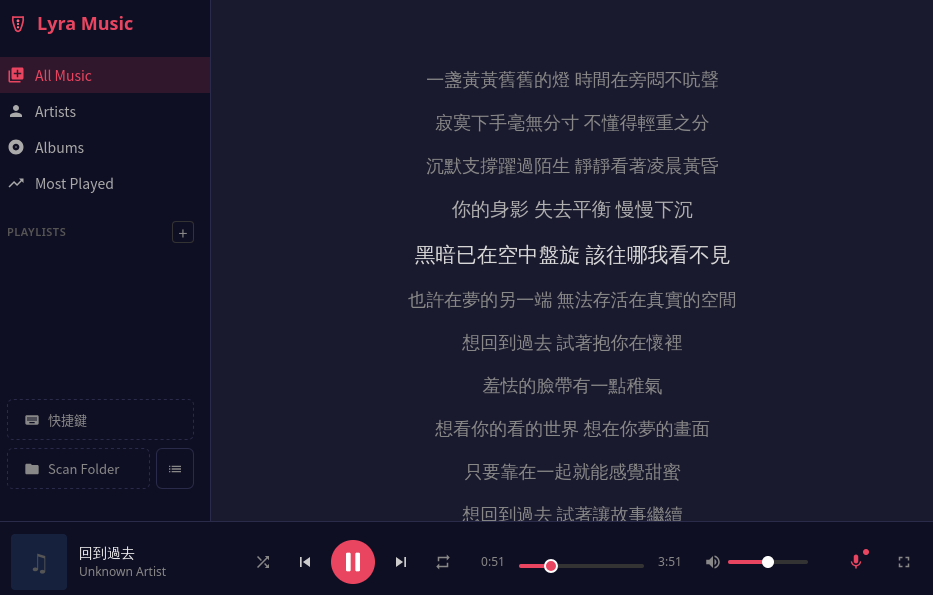

<p align="center">
  
</p>

# Lyra Music

[English](README.en.md) | 繁體中文

[](https://github.com/twtrubiks/lyra-music/actions/workflows/ci.yml)
[](https://github.com/twtrubiks/lyra-music/releases)
[](https://tauri.app/)
[](https://svelte.dev/)
[](https://www.typescriptlang.org/)
[](https://www.rust-lang.org/)
[](https://github.com/RustAudio/rodio)

基於 Tauri 2 + Svelte 5 + Rust 的桌面音樂播放器。純本地離線播放，不依賴任何網路服務。

## 畫面截圖




## 為什麼是 Lyra Music？

Lyra 的設計原則：

**零依賴啟動** -- 音訊引擎使用 [rodio](https://github.com/RustAudio/rodio)（純 Rust），不需要 GStreamer、MPV、FFmpeg。下載二進位即可執行。

**輕量、不是小功能** -- Tauri 2 不捆綁 Chromium，記憶體佔用遠低於 Electron 方案。但保留了多數使用者實際需要的功能：Gapless Playback、斷點續播、播放清單管理、元資料編輯、System Tray。

**你的音樂留在你的機器** -- 無 telemetry（不會在背景收集或回傳任何使用資料）、無帳號、無網路請求。MIT 授權，程式碼完全透明。

## 下載

前往 **[GitHub Releases](https://github.com/twtrubiks/lyra-music/releases/latest)** 下載最新版本（支援 AppImage、deb、rpm）。

## 技術架構

延伸閱讀：[為什麼選擇 Rust](docs/why-rust.md)、[Tauri 2 介紹](docs/tauri2-introduction.md)

| 層級 | 技術 | 說明 |
|------|------|------|
| 前端 | Svelte 5 + TypeScript | 使用 Svelte 5 runes 做響應式狀態管理 |
| 建置工具 | Vite 8 | 開發伺服器與前端打包 |
| 桌面框架 | Tauri 2 | 原生視窗、系統匣、IPC 通訊 |
| 後端 | Rust | 音訊處理、檔案掃描、資料庫操作 |
| 音訊引擎 | rodio 0.22 | 純 Rust 實作，不需要安裝 GStreamer、MPV 等系統音訊框架 |
| 元資料解析 | lofty 0.24 | 讀寫 ID3/Vorbis/MP4 標籤與封面圖 |
| 檔案監視 | notify 8 | 即時偵測資料夾變化，自動更新音樂庫 |
| 資料庫 | SQLite (rusqlite, bundled) | WAL mode，schema migration 管理 |
| 線上歌詞 | ureq 3 (rustls) | LRCLIB API 手動搜尋，同步歌詞快取為 `.lrc` sidecar |
| 測試 | Vitest + cargo test | 前端 22 個測試檔、後端 19 個整合測試 |

## 主要功能

**本地音樂播放** -- 支援 MP3、FLAC、WAV、OGG、M4A、AAC 格式。音訊引擎基於 rodio，play / pause / stop / seek 完整控制，音量使用二次曲線映射（UI 0.5 對應實際 0.25），聽感更自然。

**Gapless playback** -- 預先解碼下一首並 append 到同一 sink，實現無縫銜接。不要求前後曲目 sample rate 一致。

**播放清單與斷點續播** -- 建立、編輯、刪除播放清單，支援拖曳排序。每個播放清單記錄最後播放的曲目與秒數位置，按播放清單的「播放」鈕即從上次進度繼續；雙擊指定曲目則從該曲目從頭播放。

**Mini Player + System Tray** -- 按 `m` 切換為 420x80 精簡視窗（always-on-top）。系統匣支援 Play/Pause、上一首、下一首、顯示視窗、退出。關閉視窗時自動最小化到系統匣。

**Tauri 2 + Svelte 5 + Rust 架構** -- 前後端透過 42 個 Tauri commands 進行 IPC 通訊。前端以 Svelte 5 runes 管理狀態，後端以 Rust 處理音訊解碼、檔案 I/O、資料庫操作。

其他功能：
- 時間同步滾動歌詞與線上歌詞搜尋（LRCLIB）——取得方式見[歌詞](#歌詞)
- 藝人 / 專輯瀏覽視圖（網格封面、搜尋過濾、詳情視圖）
- 曲目元資料編輯（標題、藝人、專輯寫回檔案）
- 資料夾即時監視（新增/修改/刪除自動同步音樂庫；搬移/改名保留播放統計與清單歸屬；可檢視與移除監控資料夾，移除不影響已匯入曲目，不存在的路徑會標示警示）
- 欄標題排序（偏好持久化）、播放計數追蹤（Most Played 排行視圖）
- 音樂庫遞迴掃描，自動讀取 metadata 與封面快取
- 播放模式（循環/單曲/隨機）、即時搜尋過濾、多選操作、右鍵選單、拖放匯入

## 歌詞

播放歌曲後按 `l`（或點播放列的 Lyrics 鈕）開啟歌詞面板。歌詞來源依優先順序：

1. **同名 `.lrc` 檔（sidecar）**——與音檔同目錄、同檔名，UTF-8 編碼：

   ```text
   ~/Music/
   ├── 周杰倫 - 晴天.mp3
   └── 周杰倫 - 晴天.lrc
   ```

2. **內嵌歌詞標籤**——音檔本身的歌詞標籤（如 MP3 的 USLT、FLAC 的 LYRICS）。
3. **線上搜尋（LRCLIB）**——前兩者都沒有時，歌詞面板會出現「線上搜尋歌詞」按鈕；純文字歌詞也可點「搜尋同步歌詞」升級為同步版。搜到的同步歌詞自動存成同名 `.lrc`（不覆蓋既有檔案），之後離線也能使用。

注意事項：

- 線上搜尋以「演出者＋標題＋時長」比對，標籤缺失或不正確都會找不到——可**右鍵曲目 →「屬性」→「編輯」**修正標題／演出者／專輯（寫回檔案）後再搜；缺演出者標籤時不會顯示搜尋按鈕。
- `.lrc` 僅支援 UTF-8，其他編碼（GBK/Big5）會被忽略並 fallback 到內嵌標籤。
- 同步歌詞隨播放進度滾動；純文字歌詞為靜態顯示。Lyrics 鈕上的指示點：灰＝純文字、紅＝同步歌詞。

## 前置需求

- [Node.js](https://nodejs.org/) (LTS)
- [Rust toolchain](https://rustup.rs/) (rustup, Rust 1.87+)
- Tauri 2 系統依賴：參考 [Tauri Prerequisites](https://v2.tauri.app/start/prerequisites/)（macOS/Windows 通常不需要額外安裝）

Linux（Debian/Ubuntu）額外需要：

```
sudo apt install libwebkit2gtk-4.1-dev build-essential curl wget file \
  libssl-dev libayatana-appindicator3-dev librsvg2-dev libasound2-dev
```

## 安裝與啟動

```bash
npm install           # 安裝前端依賴
npm run tauri dev     # 開發模式（同時啟動 Vite dev server 和 Tauri 視窗）
npm run tauri build   # 正式建置
```

建置產物位於 `src-tauri/target/release/bundle/`，支援 deb、AppImage（Linux）、dmg（macOS）、nsis/msi（Windows）。

## 測試

```bash
npm run test                    # 前端單元測試 (Vitest, 22 個測試檔)
npm run check                   # 類型檢查
cd src-tauri && cargo test      # 後端整合測試 (19 個測試檔，音訊測試預設跳過)
cd src-tauri && cargo test --features audio-tests  # 含音訊測試 (需音訊裝置)
npm run quality                 # 程式碼品質檢查 (ESLint + Prettier + Stylelint + Clippy + rustfmt)
```

## 鍵盤快捷鍵

所有快捷鍵在輸入框聚焦時不生效。

| 按鍵 | 動作 |
|------|------|
| `Space` | 播放 / 暫停 |
| `ArrowLeft` / `ArrowRight` | 快退 / 快進 5 秒 |
| `ArrowUp` / `ArrowDown` | 音量增加 / 降低 5%（曲目列表未聚焦時） |
| `n` / `p` | 下一首 / 上一首 |
| `s` | 切換隨機播放 |
| `r` | 切換循環模式（off / repeat-all / repeat-one） |
| `m` | 切換 Mini Player |
| `l` | 切換歌詞面板 |
| `Escape` | 關閉歌詞面板 / 退出 Mini Player |
| `Ctrl+F` / `Cmd+F` | 聚焦搜尋框 |
| `?` | 顯示快捷鍵說明 |

**曲目列表聚焦時：**

| 按鍵 | 動作 |
|------|------|
| `ArrowUp` / `ArrowDown` | 上一首 / 下一首曲目 |
| `Shift+ArrowUp` / `Shift+ArrowDown` | 向上 / 向下擴展選取 |
| `Ctrl+A` / `Cmd+A` | 全選曲目 |
| `Enter` | 播放聚焦曲目 |
| `Home` / `End` | 跳到第一首 / 最後一首 |
| `Ctrl+Shift+ArrowUp` / `Ctrl+Shift+ArrowDown` | 上移 / 下移選取曲目（播放清單內） |

**播放清單檢視中：**

| 按鍵 | 動作 |
|------|------|
| `Ctrl+Shift+ArrowUp` / `Ctrl+Shift+ArrowDown` | 在側邊欄上移 / 下移目前播放清單 |

## 專案結構

```
src/                              # 前端 (Svelte 5 + TypeScript)
  lib/
    api/                          # Tauri IPC 呼叫封裝 (playback, library, playlist)
    components/                   # UI 元件 (Player, Library, Browse, Playlist, Sidebar, Settings)
    state/                        # 響應式狀態管理 (Svelte 5 runes)
    logic/                        # 純函式邏輯 (播放模式、快捷鍵、格式化、選取、排序)
    types/                        # TypeScript 型別定義
src-tauri/                        # 後端 (Rust)
  src/
    audio/                        # 音訊引擎 (rodio sink, gapless queue)
    scanner/                      # 資料夾掃描與檔案監視 (walkdir, notify)
    metadata/                     # 元資料讀寫與封面快取 (lofty)
    storage/                      # SQLite 資料庫 (schema v8, WAL mode)
    commands/                     # Tauri command handlers (42 個 IPC 介面)
    models/                       # 資料結構定義 (track, playlist, player_state)
  tests/                          # 19 個整合測試
```

## Donation

文章都是我自己研究內化後原創，如果有幫助到您，也想鼓勵我的話，歡迎請我喝一杯咖啡 :laughing:

綠界科技ECPAY ( 不需註冊會員 )


[贊助者付款](http://bit.ly/2F7Jrha)

歐付寶 ( 需註冊會員 )


[贊助者付款](https://payment.opay.tw/Broadcaster/Donate/9E47FDEF85ABE383A0F5FC6A218606F8)

## 贊助名單

[贊助名單](https://github.com/twtrubiks/Thank-you-for-donate)